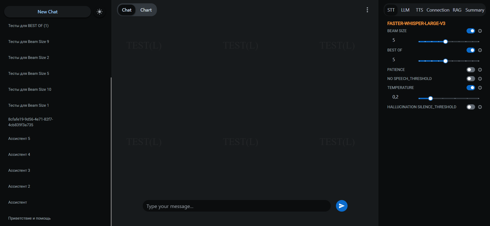

# 📚 ChatApp

Image of Admin/Chat panel

Welcome to **Zvonobot**! 🎉

# Features:
- Real-time chat
- Conversation history
- Conversation summarization
- Conversation translation
- Conversation analysis
- **Calling on SIP phones**

# License

This project and all its derivative works are protected under a custom license. The terms are as follows:

## Custom License

Copyright (c) [2024] [Alexey Svetlakov]

All rights reserved.

Permission to use, copy, modify, and distribute this software and its documentation for any purpose is hereby granted, subject to the following conditions:

1. The above copyright notice and this permission notice shall be included in all copies or substantial portions of the Software.

2. Any use, modification, or distribution of this software or its derivative works requires explicit written consent from the original author.

3. This software and its derivative works may not be used for commercial purposes without prior written agreement from the original author.

4. The author reserves the right to revoke this permission at any time.

THE SOFTWARE IS PROVIDED "AS IS", WITHOUT WARRANTY OF ANY KIND, EXPRESS OR IMPLIED, INCLUDING BUT NOT LIMITED TO THE WARRANTIES OF MERCHANTABILITY, FITNESS FOR A PARTICULAR PURPOSE AND NONINFRINGEMENT. IN NO EVENT SHALL THE AUTHORS OR COPYRIGHT HOLDERS BE LIABLE FOR ANY CLAIM, DAMAGES OR OTHER LIABILITY, WHETHER IN AN ACTION OF CONTRACT, TORT OR OTHERWISE, ARISING FROM, OUT OF OR IN CONNECTION WITH THE SOFTWARE OR THE USE OR OTHER DEALINGS IN THE SOFTWARE.

For licensing inquiries or to obtain permission for use, please contact aleksijsvetlakov00@gmail.com.

